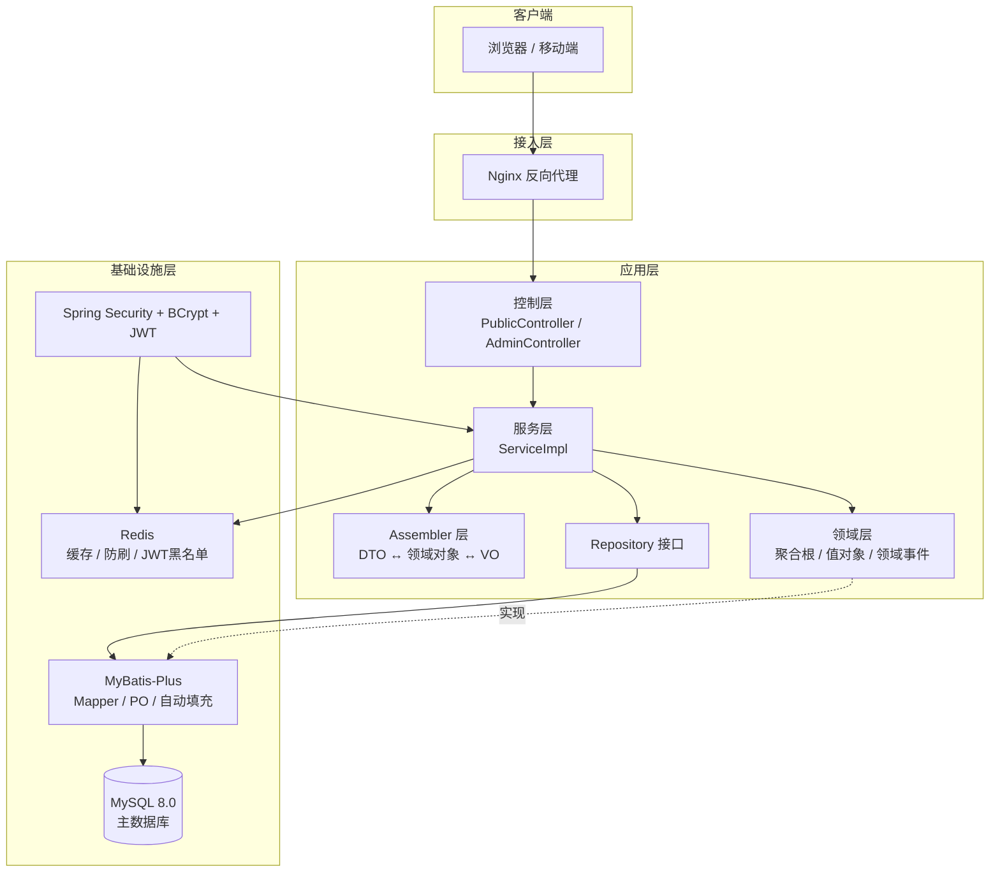
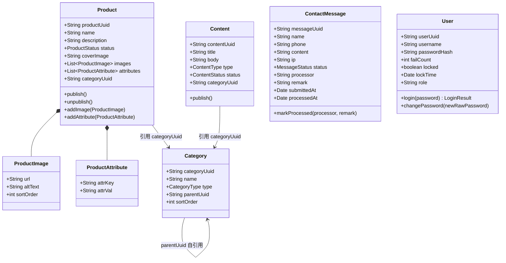
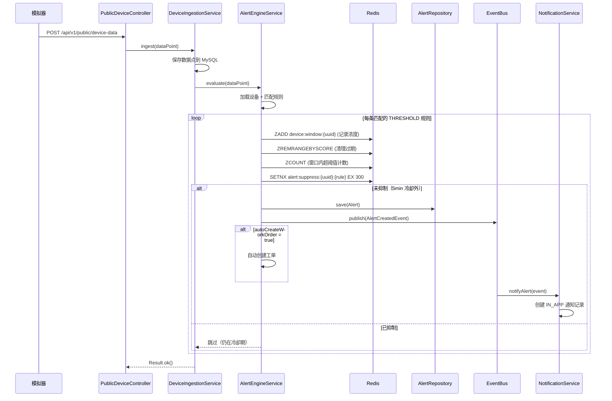
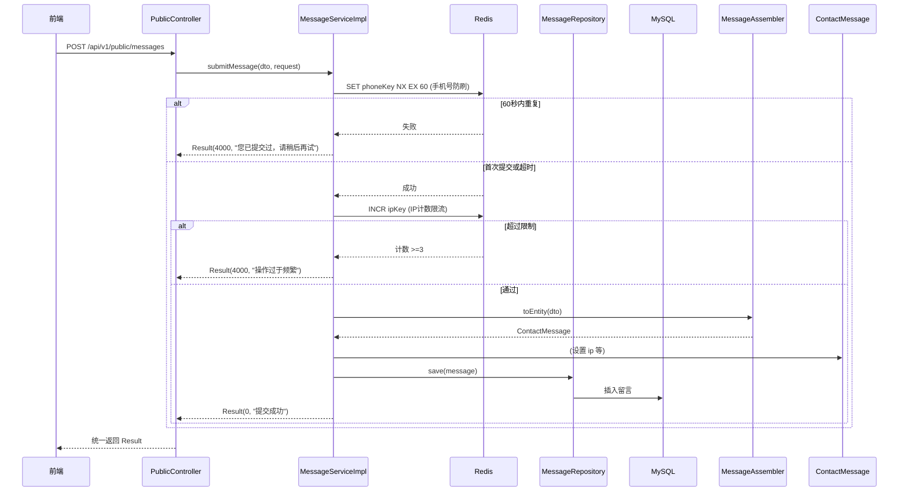
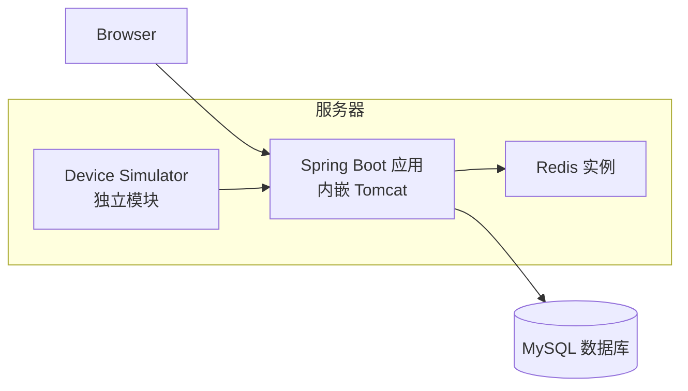
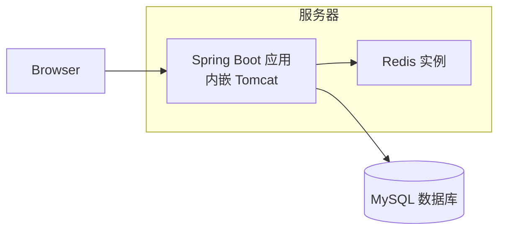

# 系统架构图

## 文档信息

- **项目名称**：工业气体报警企业官网系统
- **设计依据**：《需求文档》V1.6、《架构设计文档》V1.6、《类图设计文档（最终版）》
- **图类型**：Mermaid 格式，可直接在 Markdown 查看器中渲染
- **最后更新**：2026-05-27

---

## 概述

以下五张架构图覆盖系统设计的核心视角，与《架构设计文档 V1.6》完全对齐：

| 图 | 视角 | 对应架构文档章节 | 用途 |
|----|------|-----------------|------|
| 1. 系统分层架构 | 静态结构 | 二、总体架构 | 展示 DDD 四层分层、技术组件与依赖方向 |
| 2. 领域模型关系 | 领域建模 | 四、领域模型 | 展示 10 个聚合根/值对象的核心属性与关联 |
| 3. 设备报警引擎流程 | 动态行为 | 四.13、报警引擎设计 | 展示设备数据上报→报警触发→通知的完整时序 |
| 4. 客户线索提交流程 | 动态行为 | 六、服务层（防刷） | 展示留言提交的完整时序与防刷机制 |
| 5. 部署视图 | 运行时物理 | 九、非功能需求 | 展示 V1.6 阶段的服务器部署拓扑 |

---

### 1. 系统分层架构与关键技术栈

**关键设计要点**：

| 层级 | 职责 | 关键约束 |
|------|------|---------|
| **接入层** | Nginx 反向代理，负责 SSL 终结、静态资源缓存、请求转发 | MVP 可与应用同机部署 |
| **控制层** | PublicController（前台）和 AdminController（后台），仅做路由分发与参数校验 | 禁止 if/else 业务判断、禁止直接调 Repository/Redis |
| **服务层** | ServiceImpl 编排领域对象、Assembler、Repository，管理 `@Transactional` | 通过 Assembler 做 DTO↔Domain↔VO 转换 |
| **Assembler 层** | DTO ↔ 领域对象 ↔ VO 的纯数据映射 | 严禁包含任何业务逻辑或默认值赋值 |
| **领域层** | 聚合根封装业务行为（如 `publish()`），Repository 接口定义查询契约 | **零框架依赖**：禁止 Spring/MyBatis/Lombok 注解 |
| **基础设施层** | MyBatis-Plus Mapper/PO 实现持久化；Redis 提供缓存与防刷；Security 实现认证 | 通过依赖倒置实现领域层接口，对领域层零侵入 |

**依赖方向**：实线箭头（→）表示编译期依赖，虚线箭头（-.->）表示运行时实现。所有依赖自上而下，领域层不依赖任何外部框架。

---

### 2. 领域模型核心关系（简化类图）

**关键设计要点**：

| 聚合根 | 所属上下文 | 核心行为方法 | 关联关系 |
|--------|-----------|-------------|---------|
| `Product` | 产品上下文 | `publish()`, `unpublish()`, `addImage()`, `addAttribute()` | 组合 `ProductImage`（1..\*）、`ProductAttribute`（0..\*）；引用 `Category` |
| `Content` | 内容上下文 | `publish()` | 引用 `Category`；通过 `ContentType` 枚举区分解决方案与新闻 |
| `Category` | 分类上下文 | -（树形自引用） | 通过 `parentUuid` 自引用形成树形结构；通过 `CategoryType` 隔离产品分类与内容分类 |
| `ContactMessage` | 线索留言上下文 | `assign()`, `markProcessed()` | 三态流转 PENDING→IN_PROGRESS→PROCESSED；IP 由后端注入 |
| `User` | 认证上下文 | `login(password)`, `changePassword()` | BCrypt 编码；角色 ADMIN/STAFF/USER |
| `Staff` | 员工管理上下文 | — | 独立于 t_admin_user，4 种角色 × 4 种状态 |
| `WorkOrder` | 工单管理上下文 | `assign()`, `complete()` | 三态流转 PENDING→IN_PROGRESS→COMPLETED |
| **`Device`** | **设备管理上下文** | **`markAbnormal()`, `markNormal()`, `markOffline()`, `startMaintenance()`, `endMaintenance()`** | **4 种状态：NORMAL/ABNORMAL/OFFLINE/MAINTENANCE** |
| **`AlertRule`** | **报警规则上下文** | **`evaluate(concentration)`, `enable()`, `disable()`** | **3 种类型：THRESHOLD/OFFLINE/LOW_BATTERY；全局/设备级** |
| **`Alert`** | **报警记录上下文** | **`confirm()`, `resolve()`, `close()`** | **4 态流转 PENDING→CONFIRMED→RESOLVED→CLOSED；事件驱动通知** |
| **`Notification`** | **通知记录上下文** | **`markSent()`, `markFailed()`** | **3 种通道：IN_APP/SMS/EMAIL** |
| **`DeviceDataPoint`** | **设备遥测上下文** | — | **按时间范围查询历史数据** |

**关系符号说明**：`*--` 表示组合关系（强生命周期绑定），`-->` 表示引用关系（逻辑关联，无物理外键）。`Alert` 引用 `Device`，`AlertRule` 可选引用 `Device`，`Notification` 引用 `Alert`，`Alert` 可选关联 `WorkOrder`。

---

### 3. 设备报警引擎流程（V1.6 新增）

**关键设计要点**：

| 阶段 | 操作 | 实现方式 | 说明 |
|------|------|---------|------|
| ① 数据接入 | `POST /public/device-data` | 无需认证 | 模拟器/真实设备上报遥测数据 |
| ② 数据持久化 | `DeviceDataPointRepository.save()` | MySQL INSERT | 原始数据完整保存，支持历史查询 |
| ③ 规则匹配 | 加载设备专属规则 + 全局规则 | `AlertRuleRepository` | 全局规则 `deviceUuid` 为空 |
| ④ 滑动窗口 | Redis ZSet `device:window:{uuid}` | `ZADD` + `ZREMRANGEBYSCORE` | 1h TTL，score=时间戳秒数 |
| ⑤ 去重抑制 | Redis String `alert:suppress:{uuid}:{rule}` | `SET NX EX 300` | 同一设备+同一规则，5min 内最多 1 次 |
| ⑥ 报警创建 | `AlertRepository.save(Alert)` | MySQL INSERT | 状态 PENDING，记录触发浓度和阈值 |
| ⑦ 事件发布 | `EventBus.publish(AlertCreatedEvent)` | Spring `@EventListener` | 异步处理通知和自动创建工单 |
| ⑧ 通知创建 | `NotificationService.notifyAlert()` | MySQL INSERT | 当前仅 IN_APP 通道，SMS/Email 预留 |

---

### 4. 客户线索提交流程与防刷机制

**关键设计要点**：

| 阶段 | 操作 | 实现方式 | 失败返回 |
|------|------|---------|---------|
| ① 前端校验 | 校验字段合法性（姓名≤50字符、手机号 `1\d{10}`、需求5-500字符） | 前端 `validate()` | 标红对应字段 |
| ② 手机号防刷 | `SET phone:{phone} 1 NX EX 60` | Redis `setIfAbsent` | `4000` "您已提交过，请稍后再试" |
| ③ IP 限流 | `INCR ip:{ip}`，首次设置 `EXPIRE 60` | Redis `increment` | `4000` "操作过于频繁，请稍后重试" |
| ④ 组装领域对象 | `MessageAssembler.toEntity(dto)` → `ContactMessage` | Assembler 纯映射 | - |
| ⑤ IP 注入 | 从 `HttpServletRequest.getRemoteAddr()` 获取 | Service 层填充 | - |
| ⑥ 持久化 | `MessageRepository.save(message)` → MySQL INSERT | MyBatis-Plus Mapper | `5001` 系统内部错误 |

**防刷参数**：手机号 60 秒内仅允许 1 次；同一 IP 每分钟最多 3 次。两个 Redis Key 独立过期，互不影响。

---

### 5. 部署与运行时视图（V1.6）

**关键设计要点**：

| 组件 | 角色 | V1.6 配置 | 说明 |
|------|------|---------|------|
| **浏览器** | 客户端 | Chrome/Safari/Edge 最新版 | 响应式布局，适配 375px-1920px |
| **Spring Boot 应用** | 业务服务器 | 内嵌 Tomcat，单实例部署 | 包含全部业务逻辑、API 接口、报警引擎 |
| **Device Simulator** | 设备模拟器 | 独立 Maven 模块，同机运行 | 模拟多设备定时上报遥测数据，仅开发/演示用 |
| **Redis 实例** | 缓存/防刷/报警引擎 | 单机，与应用同服务器 | 分类缓存、防刷计数、JWT 黑名单、报警滑动窗口、去重抑制、Dashboard 缓存 |
| **MySQL 数据库** | 持久化存储 | MySQL 8.0，可独立服务器 | InnoDB 引擎，utf8mb4 字符集，17 张业务表 |

**V1.6 简化原则**：

**关键设计要点**：

| 组件 | 角色 | MVP 配置 | 说明 |
|------|------|---------|------|
| **浏览器** | 客户端 | Chrome/Safari/Edge 最新版 | 响应式布局，适配 375px-1920px |
| **Spring Boot 应用** | 业务服务器 | 内嵌 Tomcat，单实例部署 | 包含全部业务逻辑、API 接口、静态资源 |
| **Redis 实例** | 缓存/防刷 | 单机，与应用同服务器 | 分类缓存（TTL 1h）、手机号/IP 防刷、JWT 黑名单 |
| **MySQL 数据库** | 持久化存储 | MySQL 8.0，可独立服务器 | InnoDB 引擎，utf8mb4 字符集，7 张业务表 |

**MVP 简化原则**：
- 不使用 Nginx 反向代理（除非需要 HTTPS 终结）
- 不引入消息队列（领域事件采用同步日志）
- 不引入微服务/容器化（单 JAR 部署）
- Redis 和 MySQL 可按需升级为独立服务器或集群

**架构图的核心作用**：
- 分层图展示职责隔离与依赖方向，保证团队编码规范；
- 领域模型图统一核心业务概念，避免贫血模型；
- 时序图固化关键流程（防刷、事务与事件）；
- 部署图明确 MVP 阶段运行形态，避免过度设计。

---